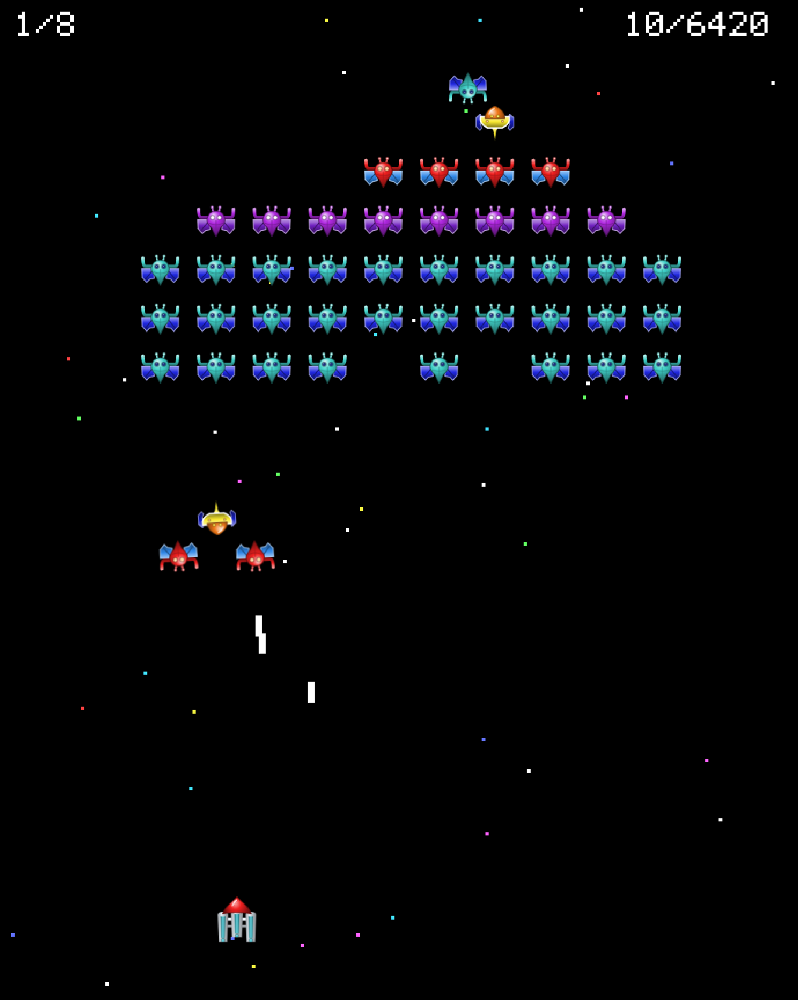

## Summary
A remake of the classic arcade game Galaxian: the player's ship moves along the bottom of the screen and shoots down waves of alien ships that dive at it while dropping bombs.
The formation moves from side to side and launches attacks; each destroyed wave gives way to a faster one, with a different formation and mix of ships: the four arcade types are joined by three with attacks of their own (zigzag, ramming and sniper).
Destroying a diving yellow ship together with its escort drops a random power-up. The player has three ships; the scoreboard shows the wave and the points next to their high scores. It is played in the browser with the keyboard or, on a phone, with the touch screen.
The project is also a public demo of how Claude Visual Project works, so all its docs are written in English.

## Decisions
- 2026-10-03 18:16 · Project created with Claude Visual Project.
- 2026-10-03 18:22 · Initial requirements spread over the tree: partida (game), jugador (player), enemigos (formation and attack), marcador (scoreboard), graficos (graphics) and sonido (sound).
- 2026-10-04 10:52 · New node power-ups: random powers when a diving yellow ship and its escort are destroyed.
- 2026-10-05 14:19 · The project is published as a demo of how CVP works: every md in the repository is translated into English, and from now on the docs are written in English (rule in global-rules, Project rules). Node slugs, file paths and code names stay as they were, in Spanish, so the tree and its links keep working; the files in sources/ are kept unchanged; the texts shown in the game are not part of this change.

## Requirements
- 2026-10-03 18:13 · This is about reimplementing a classic arcade game: Galaxy.
- 2026-10-03 18:13 · Full requirements in sources/KillerFlies.txt, with the screenshots sources/KF1.JPG and sources/KF2.JPG.
- 2026-10-05 13:29 · I want to publish this project (static HTML) as a 'demo' of how CVP works. Can you translate all the md files into English to make it more accessible to all users?

## Overview

